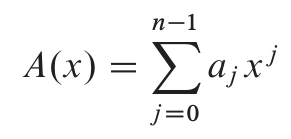

# Signal Transformations

### Polynomials

A polynomial on a variable x over Field f represents a function as so:

You can evaluate a polynomial in (n log n) time using the roots of unity. This is useful for computing the DFT in computationally short time (FFT).

### FFT

### DFT

